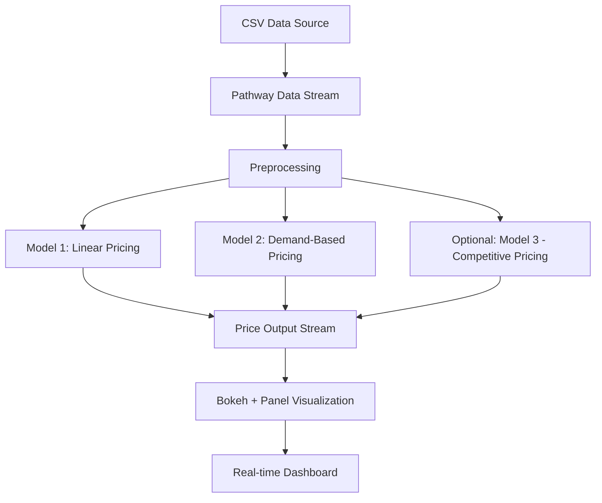

# 🚗 Dynamic Pricing for Urban Parking Lots

Welcome to the repository for the **Summer Analytics 2025 Capstone Project** hosted by the **Consulting & Analytics Club** in collaboration with **Pathway**.  
This project implements a **real-time, intelligent parking pricing system** using only `pandas`, `numpy`, and `Pathway` for streaming simulations.

---

## 📌 Overview

Urban parking faces underutilization or over-congestion when static prices are used. This system dynamically adjusts parking prices **in real-time** using data-driven models based on:
- Occupancy
- Queue Length
- Traffic Congestion
- Vehicle Type
- Special Events
- Competitor Prices (Optional Model 3)

We simulate real-time data streams and pricing engines to optimize parking lot usage through adaptive, explainable price updates.

---

## 🛠️ Tech Stack

| Technology       | Purpose                             |
|------------------|-------------------------------------|
| `Python`         | Core programming                    |
| `pandas` / `numpy` | Data preprocessing and modeling   |
| `Pathway`        | Real-time stream processing         |
| `Bokeh`          | Real-time visualization             |
| `Panel`          | Dashboard and interaction layer     |
| `Google Colab`   | Cloud-based development             |

---

## 🧩 Architecture Diagram



---

## 🔄 Project Workflow

### 🔹 Step 1: Data Ingestion
- Real-time data from 14 parking spaces is streamed using Pathway's `replay_csv`.
- Combined and parsed `Timestamp` column.

### 🔹 Step 2: Feature Engineering
- Traffic and vehicle types are encoded.
- Normalized demand calculated using:
  ```
  demand = α*(occupancy/capacity) + β*queue - γ*traffic + δ*special_day + ε*vehicle_type
  ```

### 🔹 Step 3: Pricing Models
#### ✅ Model 1 - Linear:
\`\`\`Price = base + α * (Occupancy / Capacity)\`\`\`

#### ✅ Model 2 - Demand-Based:
\`\`\`Price = base * (1 + λ * NormalizedDemand)\`\`\`

#### 🧠 Model 3 (Optional) - Competitive:
- Uses location data and neighboring prices for intelligent rerouting and pricing

### 🔹 Step 4: Real-Time Visualization
- Output streamed to **Bokeh** + **Panel** for continuous interactive plotting

---

## 📄 Additional Documentation

- 📓 `Dynamic_Pricing_Notebook.ipynb` – full code with plots & explanations
- 📁 `final_submission_data.csv` – enriched dataset with model outputs
- 📑 `problem statement.pdf` – original challenge description
- 📘 `report.pdf` *(Optional)* – can be added here if generated

---

